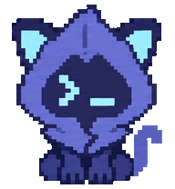

# Agent Pet

**English** · [简体中文](README.zh-CN.md)

Two animated companions for the Codex-compatible desktop pet system: **Indigo** and **G.E.M.** Each pet includes 9 animation states and 16 look directions.

**[How-to](docs/HOW_TO.en.md)** · **[Download](https://github.com/Erizo0818/agent-pet/releases/latest)**

| Indigo | G.E.M. |
| :---: | :---: |
|  |  |
| Blue-violet pixel cat with a cyan `>_` face. | Chibi singer inspired by G.E.M.'s stage appearance. |
| [Download ZIP](https://github.com/Erizo0818/agent-pet/releases/latest/download/indigo-cat.zip) · [All actions](previews/indigo-cat/actions.gif) | [Download ZIP](https://github.com/Erizo0818/agent-pet/releases/latest/download/gem-tang.zip) · [All actions](previews/gem-tang/actions.gif) |

## Quick install

Download a pet ZIP from [Releases](https://github.com/Erizo0818/agent-pet/releases/latest), extract it, and copy the pet's folder into your local pets directory:

```text
~/.codex/pets/
├── indigo-cat/
│   ├── pet.json
│   └── spritesheet.webp
└── gem-tang/
    ├── pet.json
    └── spritesheet.webp
```

The archives also include license and credit files. If your desktop app uses a custom `CODEX_HOME`, use its `pets` subdirectory instead.

Open **Settings → Pets → Refresh**, choose your pet, and enter `/pet` to wake it. Installation needs no API key, image generation, or build step. See the [official Pets guide](https://learn.chatgpt.com/docs/pets) for the current app controls.

For detailed installation steps, Windows paths, updates, and removal, see the [How-to guide](docs/HOW_TO.en.md).

## Included animations

Idle, move right, move left, wave, jump, failure, waiting for input, working, and review, plus 16 look directions. The host app controls which animation plays.

Both pets use `spriteVersionNumber: 2`: a transparent **1536 × 2288** WebP atlas, **8 columns × 11 rows**, and **192 × 208** pixels per cell. The GIFs are previews; install the WebP together with its manifest.

## Repository layout

```text
pets/       Installable pet manifests and spritesheets
previews/   Idle and nine-action GIF previews
docs/       Chinese and English how-to guides
LICENSE     MIT license
CREDITS.md  Artwork provenance and third-party rights
```

## License and credits

Project contributions are released under the existing [MIT license](LICENSE), to the extent of the contributors' rights. Reference artwork and third-party names, likenesses, and trademarks are not separately licensed by this project. See [CREDITS.md](CREDITS.md).

This is a community project. It is not affiliated with or endorsed by OpenAI, G.E.M., or her representatives.
